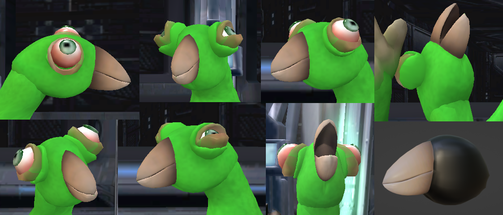

# Wombler

[Partially based on a type of organism of the same name from Serina by Sheather888.](https://sites.google.com/site/worldofserina/the-hypostecene-0---15-million-years/biome-the-central-anciskan-floodplains)
